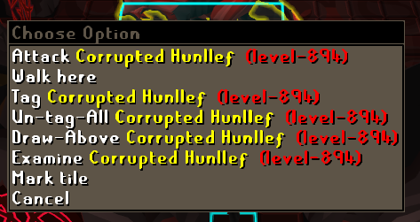
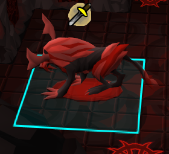

# Improved Tile Indicators
An improved version of tile indicators

## Features
### Draw behind player
Draws overlays behind the player

### Draw behind NPC
Draws overlays behind the NPCs. Should not be used for large groups of NPCs, but rather for bosses or smaller groups of NPCs.

### Destination tile style
Allows you to change the destination tile style

