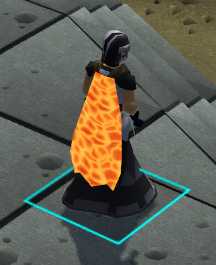
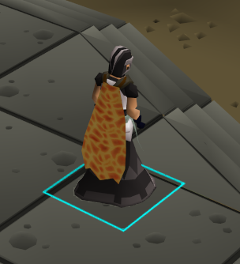
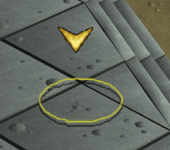

# Example
An improved version of tile indicators

## Features
### Draw behind player
Draws the true tile indicator behind the player

### Destination tile style
Allows you to change the destination tile style

